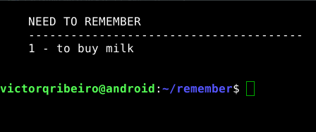

# Remember

Remember is a simple bash script that allows you to write "to do" lists and things you want to remeber, in your terminal.



## How to use

- Give remember execute permission

    ```bash
    chmod +x remember
    ```

- Then just call remeber with the thing you want to remember

    ```bash
    ./remember "to buy milk"
    ```

- If you call remeber without any parameters, it'll display the things you have to remember:

    ```bash
    ./remember
    ```

- To erase something, pass the ! parameter with the number of the thing you want to forget:

    ```bash
    ./remember ! 1
    ```

- Or to erase everything at once, just call remeber nothing:

    ```bash
    ./remember nothing
    ```

## Important

To work as it was intended, you should put it in your scripts folder and add it to the bash config file `~/.bashrc`

```bash
PATH=$PATH:~/scripts
remember
```

That way everytime you open the terminal it will show you the things you have to remeber, and also, you will be able to call it without the `./`
